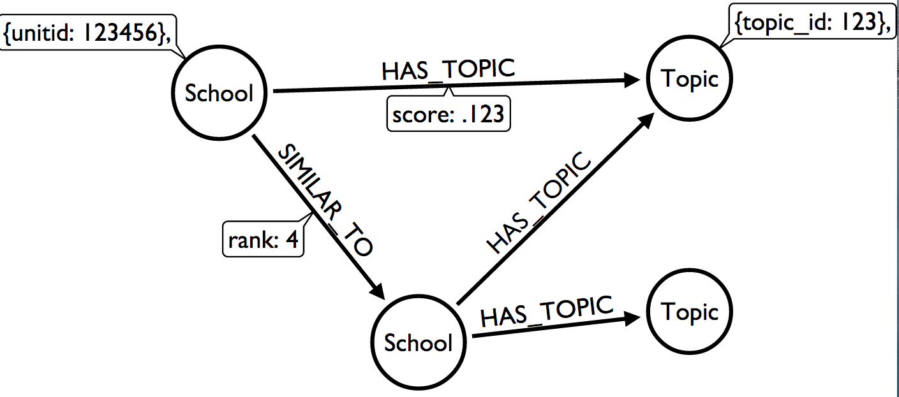

```{r setup, echo=F, message=F, warning=FALSE}

## load the libraries
library(pander)
library(RNeo4j)
library(GGally)
library(igraph)
library(stringr)
library(ggplot2)
library(dplyr)
library(DT)

## basic options
panderOptions("table.split.table", Inf)
panderOptions("table.style", "rmarkdown")
options(width=150)
knitr::opts_chunk$set(comment = NA) 

## chunk options for this post
knitr::opts_chunk$set(fig.path='{{ site.url }}/images/mission-statement-topics-')


```


## TL:DR

Below I use Prismatic's API to tag the mission statements of approximately 500 colleges in the U.S. in order to evaluate the "focus" of each, which I define as the topics extracted from the API.  In addition, I also consider the competitive nature of various schools, commonly refered to as the "Competitor Set".

Out of the gate, I considered more than 1,000 schools for this study.  In the end, I only kept institutions with clean data, that is, no missing information across all of the data I collecteted.  Simply, I threw out a ton of data, but that's ok, this is more an exploration to think do the following:

#### How "accurate" is the Interest Graph prediction of the topics contained within the mission statements?
It's important to note that there are two sources of error; the API could mis-classify the mission statement, or perhaps the language of the mission statement is vague.

#### Are topics related to admissions performance?
This isn't really a pratical business problem, but hey, if we have the data, why not give it a shot?

## Quick Side Note

This is intended to be a quick post on playing around with the recently released [Prismatic Interest Graph API](http://blog.getprismatic.com/interest-graph-api/).  I encourage you to take a few minutes to scan the blog post; very cool stuff!  

For me, the timing couldn't be better, as I have been thinking alot about graphs in the recent months, and the idea of being to assign topics to text makes this all the better. 

> As I am wrapping up the work on this post, I noticed they just enhanced the API to search for related topics.  Awesome! I put together a basic R Package [prismaticR](https://github.com/Btibert3/prismaticR).  Let me know what you think!

I am going to use the API to extract topics from a fairly specific set of institutions' mission statements.  Needless to say, a mission statement says a lot about an institution and what they stand for.  My idea is to use the API to extract the larger themes and see if the intent matches "reality", as defined by the results of the API call.  

-  What institutions tend to focus on the same topic?   
-  Are certain topics associated with "higher profile" institutions?  
-  Based on the topics extracted, is there evidence to suggest that some mission statements miss the mark?  

I encourage you to head over to my [Github repo](https://github.com/Btibert3) to review my code where all data collect is done within R, no point-and-click necessary!  By no means is my code pristine, but hopefully it can help you out if you are learning R.

## The Data  

First, a talk about the schools that I am including in this work.  Here are my criteria:  

-  The institution is located in the domestic US (and is not a military institution)  
-  Public 4-year and Private, 4-year not-for-private __degree-granting__ institutions  
-  Enrolled more than 300 first-year students  

This is a pretty specific set of institutions, and certainly does not reflect the "average" college in the U.S, but my aim is to include as many "traditional colleges and universities" as possible.

After getting this list of about 1,000 schools, I crawled each institutions' [College Navigator](http://nces.ed.gov/collegenavigator/) page to parse out URL for their mission statement.  Not all institutions present a URL, so I removed any institution that included a mission statement in text-form on the profile page.  I know this isn't ideal, but I wanted to throw data together quickly.

From there, I used the Interest Graph API to tag each mission statement with predicted "topics."  The API was able to make successful requests on a large number of pages, but there were a handful of instances where the API returned null results, or more likely, the API was not able to extract topics due to insuffient text.  I also removed these schools from consideration.

Next, I grabbed some basic admission metrics for these schools from IPEDS.  More specifically, I included things like admit rate (the % of applicants that were offered admission), SAT metrics, and school size.  There are a few other data points, so take a look at my code to see which IPEDS variables I included.  I didn't want to go down the rabbit's hole and analyze every metric, but I grabbed a handful available just in case.

Lastly, of those institutions that "made the cut", I included what some might consder their competitive set.  A few notes on this:

-  I crawled a popular college search site to extract each institution's "Similar" colleges.  It's just one source of data, but they seem ok to me.  
-  Again, I only included the competitive information for the schools that had complete data from above

It's worth noting that not all institutions will have competitive data.  This could be due to the fact that my crawler didn't parse everything properly, or, the site did not display this information, which I verififed on a few of the cases.

To make this analysis possible, I used `RNeo4j` to put these datasets into a [graph](http://en.wikipedia.org/wiki/Graph_(abstract_data_type)), using the data model shown below:



Our dataset has two types of nodes, `School` and `Topic`.  Schools are connected to topics through a `HAS_TOPIC` relationship, with a value that I assume is the API's confidence for the topic.  Schools are also connected to other Schools through a `SIMILAR_TO` relationship, with a rank value.  A rank of 1 implies the closest competitor.


## Descriptive Stats

```{r echo=FALSE}
## connect to neo4j
graph = startGraph("http://localhost:7474/db/data/")

```


Here are some quick cypher queries to explore the data we have loaded into the database.

#####  Summary of the graph
```{r, comment=NA}
summary(graph)
```


###### How many nodes are in the database

```{r, comment=NA}
cypher(graph, "MATCH (n) RETURN COUNT(n)")
```

######  Count of distinct node types

```{r, comment=NA}
query = "
// counts by distinct node type
MATCH n 
RETURN DISTINCT LABELS(n), COUNT(n)
"
cypher(graph, query)
```

###### Count of relationship types
```{r, comment=NA}
cypher(graph, "MATCH ()-[r]->() RETURN type(r), count(*)")
```


## Explore the Graph  

The table below shows 10 rows of data were schools are connected to topics.


```{r echo=F, comment=NA, message=F, warning=FALSE}
query = "
MATCH (s:School)-[r]->(t:Topic)
RETURN s.unitid as school, s.instnm as name, t.topic as topic, r.score as score
LIMIT 10
"
dat10 = cypher(graph, query)

## print  rows
pander(dat10)

```

It's important to note that this is only half the picture.  If you refer back to the graph model above, notice that we are only looking at the connections between `School` and `Topic`, when in reality, we also have edges between `School` and `School`.  This is demonstrated below.


```{r echo=F, comment=NA, message=F, warning=FALSE}
query = "
MATCH (s1:School)-[r]->(s2:School)
RETURN s1.instnm as `From School`, s2.instnm as `To School`, r.rank as Rank
LIMIT 10
"
dat10 = cypher(graph, query)
dat10 = arrange(dat10, Rank)

## print  rows
pander(dat10)

```

In the table above, we are looking at the connections between schools, where `From` is considered `SIMILAR_TO` `To`.  The column rank indicates competitor strength, where Rank 1 is considered he most "similar" school.  We could debate the definition of "similar" all day long, so I will spare that for a later blog post.

It might help to put a picture to the data ...

```{r echo=F, message=FALSE, warning=FALSE}

## the query to link schools to topics
q1 = "
MATCH    (s1:School)-[rt:HAS_TOPIC]->(t:Topic)
RETURN   s1.unitid as from, t.topic as to, rt.score as weight
LIMIT 25
"
dat1 = cypher(graph, q1)

## the query that links schools to schools
q2 = "
MATCH    (s1:School)-[rt:SIMILAR_TO]->(s2:School)
RETURN   s1.unitid as from, s2.unitid as to, rt.rank as weight
LIMIT 25
"
dat2 = cypher(graph, q2)

## bind the data
dat = rbind(dat1, dat2)
rm(dat1, dat2, q1, q2)


## put the data into a graph object in igraph
g = graph.data.frame(dat)

## plot the graph
ggnet(g,                          # an object of class network
      mode = "fruchtermanreingold", # placement algorithm
      size = 6,                    # node size
      alpha = .5,                  # transparency
      weight.method = "none",       # what to weight the nodes with: "degree", "indegree", "outdegree"
      names = c("", ""),            # what to call the node color and node weight legends
      node.group = NULL,            # what to color the nodes with
      node.color = NULL,            # what colors to use for the node classes
      node.alpha = NULL,            # transparency for nodes (inherits from alpha)
      segment.alpha = NULL,         # transparency for links (inherits from alpha)
      segment.color = "grey",       # default links are rgb(190, 190, 190)
      segment.label = NULL,         # label network at mid-edges
      segment.size  = .25,          # set to 0 to remove from plot
      arrow.size = 0,               # set to 0 to remove from plot
      label.nodes = FALSE,          # add vertex names in small print; can be a list of vertex names
      top8.nodes  = FALSE,          # color the top 8 nodes by weighting method with ColorBrewer Set1
      trim.labels = TRUE,           # remove '@', 'http://' and 'www.' from vertex names
      quantize.weights = FALSE,     # break weights to quartiles
      subset.threshold = 0,         # what nodes to exclude, based on weight.method ≥ subset
      legend.position = "right"    # set to "none" to remove from plot
      )   

```


While you can already start to see some interesting patterns, we are only viewing this graph as if there were only one node type ...  

```{r echo=F, warning=FALSE, message=F}

## create the group and color
node_type = ifelse(str_detect(V(g)$name, pattern="[0-9]{6}"), "School", "Topic")

## return a color for the # of levels found within node.group
node_color = RColorBrewer::brewer.pal(9, name = 'Set1')[c(1,9)]

## plot the graph
ggnet(g,                          # an object of class network
      mode = "fruchtermanreingold", # placement algorithm
      size = 6,                    # node size
      alpha = .5,                  # transparency
      weight.method = "none",       # what to weight the nodes with: "degree", "indegree", "outdegree"
      names = c("", ""),            # what to call the node color and node weight legends
      node.group = node_type,            # what to color the nodes with
      node.color = node_color,            # what colors to use for the node classes
      node.alpha = NULL,            # transparency for nodes (inherits from alpha)
      segment.alpha = NULL,         # transparency for links (inherits from alpha)
      segment.color = "grey",       # default links are rgb(190, 190, 190)
      segment.label = NULL,         # label network at mid-edges
      segment.size  = .25,          # set to 0 to remove from plot
      arrow.size = 0,               # set to 0 to remove from plot
      label.nodes = FALSE,          # add vertex names in small print; can be a list of vertex names
      top8.nodes  = FALSE,          # color the top 8 nodes by weighting method with ColorBrewer Set1
      trim.labels = TRUE,           # remove '@', 'http://' and 'www.' from vertex names
      quantize.weights = FALSE,     # break weights to quartiles
      subset.threshold = 0,         # what nodes to exclude, based on weight.method ≥ subset
      legend.position = "right"    # set to "none" to remove from plot
      )  


```


In the plot above, for the nodes when doing a before-and-after plot, but I am not sure how you can accomplish that with using `ggnet`.  

Regardless, I hope the second plot - the same graph as above - starts to paint a picture of the type of data we can play around with.  


## Analysis  

Let's start to ask some questions from the database. 

##### Topic Distribution  

What are the most popular topics?  The percentage indicates the fraction of mission statements having that topic.  100% would indicate every mission statement was tagged with that topic by the API.  


```{r echo=F, warning=F, message=F}
query = "
// 484 total schools -- would be cooler if I coded this up in the query on the fly
MATCH (s:School) -[r:HAS_TOPIC]-> (t:Topic) 
WITH t.topic as Topic, COUNT(DISTINCT s) as Times_Listed
RETURN Topic, Times_Listed, Times_Listed / 484.0 as Pct_Listed
ORDER BY Times_Listed DESC
"
school_dist = cypher(graph, query)

## put it into data table
pander(head(school_dist, 10))
# datatable(school_dist) %>% formatPercentage("Pct_Listed", 1)
```

You can see that even in the top 10, the concentration of topics starts to fall off fast.  For example, of the 484 schools in the dataset, approximately 80% had language in the mission statement that API clearly understood as being about Colleges and Universities.  Education, ranked 6th, was tagged in 94 mission statements, or just under 1 in every 5 schools.  

To me, this highlights that each mission statement has a focus, which is a good thing, but it might help to understand topic assignment.  How many topics are typically included in an institution's mission statement?


```{r echo=F, warning=F, message=F}
query = "
MATCH (s:School) -[r:HAS_TOPIC]-> (t:Topic) 
RETURN s.unitid as unitid, s.instnm as school, COUNT(r) as Number_Topics
ORDER BY Number_Topics DESC
"
school_dist = cypher(graph, query)

## summary by topic count
tmp = tbl_df(school_dist) %>% group_by(Number_Topics) %>% summarise(count = length(unitid))
g = ggplot(tmp, aes(Number_Topics, count)) + geom_bar(stat="Identity")
g

```

The mission statements had up to 7 topics, with the majority of schools being tagged 7 times by the API.  

#### What now?

We can see that a large share of the schools's mission statements were tagged with 7 topics.  Given what we have just seen, two interesting questions have emerged.

1.  What is it about the insitutions that __do not__ clearly write their mission statements in a way that the API would not identify the core higher ed topics?  
2.  Are there relationships between topics and admission performance and/or an institituion's competitive set.  More specifically, do institutions competing with one another have similar missions?  If we can extract the topics to understand the focus of an insitituion, is there evendince that some schools do better than others?


## Basic Admission Stats for the Top 10 Topics

For simplicity sake, let's limit the admissions performance to the top 10 topics.

```{r echo=F, warning=F, message=F}
query = "
MATCH (t:Topic) <-[r:HAS_TOPIC]- (s:School) 
RETURN t.topic as Topic, avg(s.ape) as ape, 
       avg(s.sat75) as sat75,
       avg(s.iqr) as iqr,
       avg(s.applcn) as apps,
       avg(s.enrlft) as enrollment,
       count(r) as total
ORDER BY total DESC
LIMIT 10
"
adm_perf = cypher(graph, query)

## put it into data table
pander(head(adm_perf, 10))
# datatable(adm_perf) %>% formatRound(c(2:6), 2)
```

For reference:

- `ape` = # applications per enrolled student
- `sat75` = the 75th percentile for students submitting the SAT  
- `iqr` = the middle 50% based on the SAT 75th and 25th percentiles  
- `apps` = number of first year applications  
- `enrollment` = number of first year students enrolled  
- `total` = the number of schools whose mission statement was determined to have this topic by the Prismatic Interest Graph API  

I fully admit that you should take extreme caution when trying to use the results of the API for anything other than exploratory at this point.  First off, admittedly Prismatic says that their API is in __ALPHA__ phase.  


## Top 2 Topics

The query below puts the schools into one of two buckets; whether or not their mission statement was tagged with one of the top 2 topics.

1.  Colleges and Universities, or
2.  Higher Education


```{r echo=T, warning=F, message=FALSE}

## the query
query = "
MATCH (s1:School) -[r1:HAS_TOPIC]-> (t1:Topic)
WHERE EXISTS((s1)-[:HAS_TOPIC]->(:Topic {topic:'Colleges and Universities'})) OR 
      EXISTS((s1)-[:HAS_TOPIC]->(:Topic {topic:'Higher Education'}))
RETURN 'has topic' as topic,
       avg(s1.ape) as ape, 
       avg(s1.sat75) as sat75,
       avg(s1.iqr) as iqr,
       avg(s1.applcn) as apps,
       avg(s1.enrlft) as enrollment,
       count(DISTINCT s1) as total_rels

UNION

MATCH (s2:School) -[r2:HAS_TOPIC]-> (t2:Topic)
WHERE NOT(EXISTS((s2)-[:HAS_TOPIC]->(:Topic {topic:'Colleges and Universities'})) OR 
      EXISTS((s2)-[:HAS_TOPIC]->(:Topic {topic:'Higher Education'})))
RETURN 'no topic' as topic,
       avg(s2.ape) as ape, 
       avg(s2.sat75) as sat75,
       avg(s2.iqr) as iqr,
       avg(s2.applcn) as apps,
       avg(s2.enrlft) as enrollment,
       count(DISTINCT s2) as total_rels
"
dat = cypher(graph, query)
pander(dat)


```

- `has_topic` = institutions where the mission statement includes the topics above  
- `no_topic` = the institutions were not connected to those topics

While the stats are just in aggregate, but there is bit of a gap in the 75th percentile scores, as well as a gap of 1600 more apps on average.  There is certainly more that you could do with this, but I just wanted to highlight one way you could slice the data.


## School Competition and Mission Statement Topics

I wanted to highlight how easy it is to answer some really complex questions using Neo4j.  The table below looks isolates Harvard, finds the institutions which they are `SIMILAR_TO`, and collects the topics found within each school's mission statements.  


```{r echo=T, message==F}
query = "
MATCH (s:School {unitid: 166027}) -[:HAS_TOPIC]-> (t:Topic)
RETURN s.instnm as school, COLLECT(t.topic) as topics

UNION

MATCH (s:School)-[:SIMILAR_TO]->(y:School)-[:HAS_TOPIC]->(t:Topic)
WHERE s.unitid = 166027
RETURN y.instnm as school, COLLECT(t.topic) as topics
"

dat = cypher(graph, query)
pander(dat)

```

I find it interesting that in some cases, the institution itself is a topic within the Prismatic API.


## Summary

I am still new to Neo4j to solve business problems, but hopefully you found at least some part of this post intersting or helpful.  Admittedly there isn't a lot of practical use-cases shown above, but the Prismatic API and Neo4j are fun to play around with.
